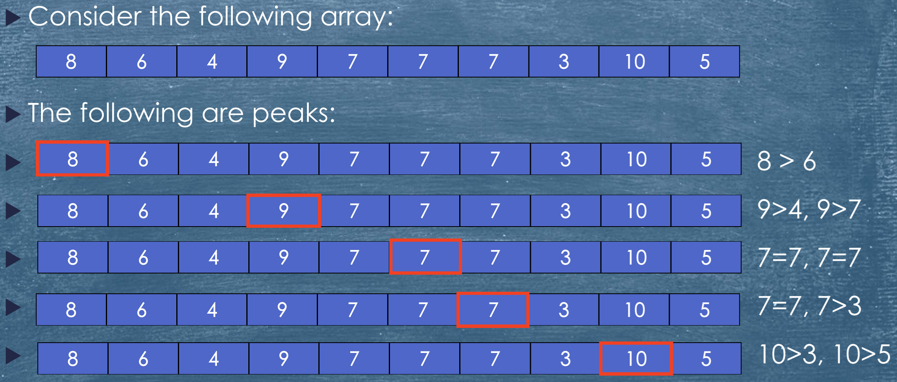
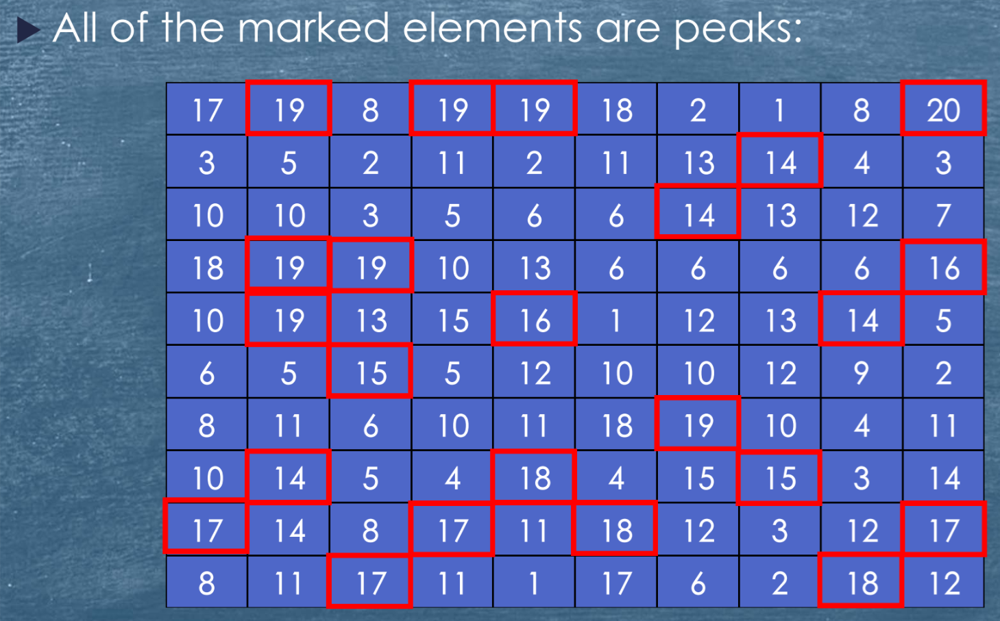
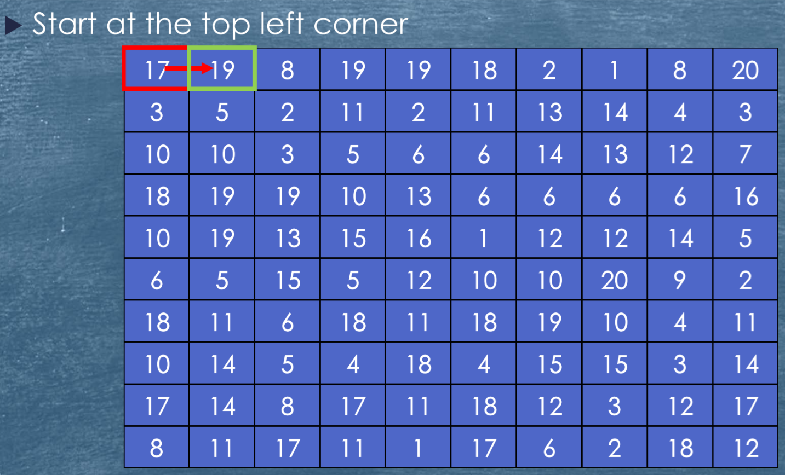
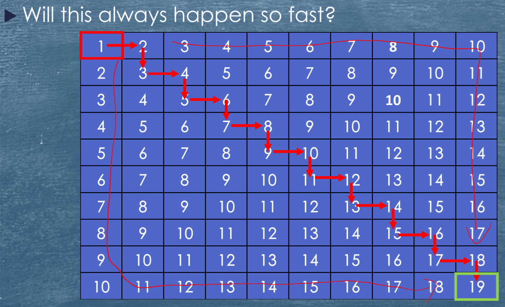
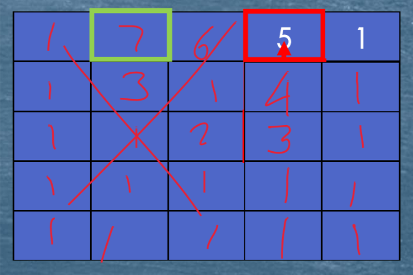

# Lecture 01a - Introduction

## Why do we need to study Algorithms?

* This is a core subject of computer science:
  * As data sets get large, efficient algorithms become critical.
  * An algorithm is only as good as it's implementation.
  * Algorithms provide an insight into how computer scientists think.
  * Knowledge of a wide range of algorithms provide a powerful problem solving skills.
* From a theoretical standpoint, the study of algorithms (**algorithmics**), has come to be the cornerstone of computer science.

> Algorithmics is more than a branch of computer science. It is the core of computer science, and, in all fairness, can be said to be relevant to most of science, business, and technology.
>
> Harel, D, '*Algorithmics: the Spirit of Computing*'

* Donald Knuth, one of the most prominent computer scientists in the history of algorithmics, put it as follows:

>  A person well-trained in computer science knows how to deal with algorithms: how to construct them, manipulate them, understand them, analyze them. This knowledge is preparation for much more than writing good computer programs; it is a general-purpose mental tool that will be a definite aid to the understanding of other subjects, whether they be chemistry, linguistics, or music, etc. The reason for this may be understood in the following way: It has often been said that a person does not really understand something until after teaching it to someone else. Actually, a person does not really understand something until after teaching it to a computer, i.e., expressing it as an algorithm . . . An attempt to formalize things as algorithms leads to a much deeper understanding than if we simply try to comprehend things in the traditional way. [Knuth, 96, p. 9]


## Peak finding

* If we have an array of numbers we can define a peak as any number that satisfies the following conditions:
  * If it is the first (or last) number, it is a peak if it is greater than, or equal to, its neighbour.
  * For any other position, it is a peak if it is greater than or equal to both of its neighbour.
  * (A neighbour is a number immediately next to the current number.)
* An example:



### Finding Peaks

* How can we find a peak given an array?
* Note:
  * There will always be at least one peak.
  * The largest value in the array must 
* This suggests:
  * Algorithm 1: Find the maximum

### Algorithm 1: Finding the Maximum

* Assume we have our numbers stored in the array `values` and that it contains `n` integers `values[1]` to `values[n]`.
* The following pseudocode will find the maximum: 

```pseudocode
maximum = values[1]
position = 1
for index = 2 to n
	if (values[index] > maximum) then
		maximum = values[index]
		position = index
	fi
rof
print "the maximum value is ", maximum, " at position " position
```

#### Is This a Good Algorithm?

* It is correct because it finds the maximum value in the array which is certainly a peak.
* This is a *good thing*&trade;.
* However, it is not efficient because:
  * It looks at every element of the array.
  * This may not be a *good thing*&trade; if `n` is very large.

#### Can we do better?

* Although the maximum is always a peak, it is not the only peak.
* A peak is a *local maximum*.
* We can stop as soon as we find any peak.
* We can use this for:
  * Algorithm 2: Linear search.

### Algorithm 2: Linear search

* The following algorithm uses linear search to find a peak:

```pseudocode
for index = 1 to n-1
	if values[index] >= values[index+1] then
		print "there is a peak with value ", values[index], " at position ", index
        stop
    fi
rof
print "there is a peak with value ", values[n], " at position ", n
```

#### Is This a Good Algorithm

* It is correct, because it finds the first value which satisfies the following properties:
  * It is greater than or equal to its left neighbour (if there is one).
  * It is greater than or equal to its right neighbour (if there is one)
* This is the definition of a peak.
* The efficiency depends on where the peak is:
  * Best case: if the peak is in position $1$, we only do one comparison.
  * Worst case: if the peak is in position $n$, we do $n$ comparisons. 
  * General case: if the peak is in position $i$,  we do $i$ comparisons. 
* On average we will look at roughly half the elements of the array: $n/2$ comparisons.
* This is still not good if $n$ is large.

#### Can we do better?

* Consider an arbitrary element of the array, `values[i]`
* There are three possible cases:
  * **Case 1:** It is smaller than its left neighbour (if any).
    * This number is not a peak.
    * But it does tell us there must be a peak to the left of this number.
    * This is because if we are only looking for a local maximum, there will always be a number that either does satisfy this case or it is a peak (greater than or equal to). 
  * **Case 2:** It is smaller than its right neighbour (if any).
    * This number is certainly not a peak.
    * Again, this also tells us there must be a peak to the right of this number.
    * This is for the same reason as case 1.
  * **Case 3:** Neither of these is true.
    * This number is a peak. 
* We can use these observations to create:
  * Algorithm 3: Binary search.

### Algorithm 3: Binary search

* The following algorithm finds a peak using binary search:

```pseudocode
start = 1
end = n
repeat
	mid = (start + end) / 2
	if values[mid] < values[mid - 1] then
		end = mid - 1
    else if values[mid] < values[mid + 1] then
    	start = mid + 1
    else
    	print "peak found at position ", mid, " with value ", values[mid]
    	stop
    fi
until forever
```

#### Is This a Good Algorithm

* Actually this algorithm is not correct because if we get down to a single value, it will not work.
  * What if start > end at some point?
* We need extra code to handle this case.
* Efficiency?
  * Each iteration eliminates half of the data (or finds a peak)
  * Best case: we find a peak straight away.
  * Worst case: we work down to a single value (which must be a peak).
    * This will take $log_2n$ iterations (which is much less than $n$ or $n/2$, especially if $n$ is large)

### Algorithm 3a: Binary Search with test for termination

```pseudocode
start = 1
end = n
repeat
	mid = (start + end)/2
	if values[mid] < values[mid + 1] then
		start = mid + 1
    else if values[mid] < values[mid - 1] then
    	start = mid - 1
    else
    	print "peak found at position ", mid, " with value ", values[mid]
    	stop
    fi
until start >= end
print "peak found at position ", mid, " with value ", values[mid]
```

## Peak Finding - Making the Problem Harder

* What if the data is not a single row but is a two-dimensional (2-D) table?
* We now define a peak as any number which is greater than, or equal to, all of its 4 neighbours:
  * Left,
  * Right,
  * Above,
  * Below,
* A number of different approaches can be used to solve this problem.



### Possible Approaches

* Once again, the global maximum is always a peak.
* If the table has $m$ rows and $n$ columns we have to at $m$ by $n$ entries and compare each with up to 4 neighbours for a total of roughly $4 \cdot m \cdot n$ comparisons.
* This is a *bad thing*&trade; 
* Perhaps we can use a variation of the best algorithm we found for the one-dimensional case.

### Steepest Ascent

* This algorithm takes an arbitrary element in the array and compares it to its immediate neighbours.
  * If it is smaller than any neighbour select the largest neighbour and repeat the process.
  * Otherwise, we have found a peak.
* Is this better than looking for the maximum?



* In the above example, we have a peak after 1 step!



#### Can we do better?

* Steepest ascent, while better than finding the global maximum, is not the best.
* Is it possible to use an algorithm that is closer in similarity to the one-dimensional algorithm?
* The problem is more complex than it looks.
* If we select an arbitrary row and column and eliminate either the left or right (or top or bottom) half will we always find a peak?
* Let's consider an example.

### A problem with our approach

* Start in the middle
* 3 > 2 so eliminate the left half
* 4 > 3 so eliminate the bottom half
* 5 > 4 so eliminate the bottom half 
* No larger neighbour so we stop (remembering that 6 and 7 were eliminated)
* However, 5 is not a peak.
* The algorithm, in fact, removed the only peak in the first step. 



### An Improved Approach

* Although eliminating half the array on the basis of an arbitrary element does not work, there is one element in a column which does guarantee that we can use this technique. 
  * The column maximum.
* The largest element in any column, if it is not a peak itself, will guarantee that a peak exists in the half of the array that contains a larger neighbour. 
* This leads to the following algorithm

### 2-D Peak Finding

```pseudocode
repeat
	find the largest element in the middle column of the remaining
array
	if the element to its left is larger then
		throw away the right half of the array
    else if the element to its right is larger then
    	throw away the left half of the array
    else
    	the maximum is a peak
    fi
until we have found a peak
```

* We need to stop when we get to a single remaining column. 
  * It's maximum must be a peak.

#### Is This a Good Algorithm?

* It is a correct algorithm.

* Efficient?

  * Each complete iteration eliminates half of the data (or finds a peak)
  * Base case: we can find a peak straight away. ($m$ operations to find the maximum).
  * Worse case: we work down to a single column (which must contain a peak)
    * This will take $log_2n$ iterations, each with $m$ operations to find the maximum.
    * This is a total of $m\cdot log_2n$ operations.

* Can we do better?

* There are many approaches to the 2-D peak finding problem.

* This proliferation of algorithms for a single task leads to the following question:

  > How do we compare two algorithms that do the same job?

## Comparing Algorithms

* How can we find the best algorithm?
* What do we mean by "best?"
  * Fastest?
  * Smallest?
  * Most general?
  * Easiest to understand?
* All of these answers are valid.
* We will look at how to compare the *fastest* speed of different algorithms

### Comparing Speed

* If we assume that each operation performed by a computer takes time...
* ... we can conclude that, the more operations it performs, the longer it takes.
* We can use this to give us a means of comparison.
* The more operations performed, the worse the algorithm for the same size of problem.

### Problem Size

* The easiest, informal, way to think about problem size is as follows:

  >  How many things does the problem contain?

* As an example consider a problem you have seen before: sorting.

* Here, the size of the problem is simply the number of items to be sorted. 

* However, sometimes the size of the problems is not so obvious. 

### Size and Complexity

* When we compare algorithms we are usually interested in how the number of operations performed grows as the problem gets bigger.
* We usually use a variable, like $n$ to refer to the problem size.
* So, if we need to sort a list of 10 numbers, $n = 10$
* If we need to sort a list of 100 numbers, $n = 100$
* We want to know not just that the amount of work performed by an algorithm grows as the problem size grows...
* We want to know *how* it grows.
* We refer to the *rate of growth* in the number of operations performed by an algorithm as $n$ grows as the **complexity** of the algorithm
* We can group algorithms into complexity classes, algorithms with approximately the same complexity. 
* We provide an abstract measure of this complexity by expressing it in terms of the problem size, $n$.

## Complexity Classes

* It is probably easiest to understand the idea of complexity classes by looking at a simple problem: finding a telephone number.
* In this case, $n$, the problem size, is the number of entries, in the directory.
* Is this the only possible size we could use?
* What about the number of pages?

### Problem 1

* You are handed the phone book and asked the following question:

> What is the first name in the book?

* Does the size of the book matter? No.
* The problem is independent of $n$.
* The complexity class of this problem is **constant**. 

### Problem 2

* You are handed the phone book and asked the following question:

> What is the phone number of Ian Piper?

* Now the size of $n$ does matter.

* But, at least the names are in alphabetical order and sorted.

* A simple and effective algorithm might be:

  ```pseudocode
  start with the whole book
  repeat
  	select the page half way through the remaining pages
  	if the name Piper appears on this page then
  		select this page
      else if the name Piper lies before this page
      	eliminate the pages after this one
      else
      	eliminate the pages before this one
      fi
  until we find the right page
  look up Ian Piper's phone number on this page
  ```

#### Analysing the Algorithm

* The algorithm consists of two tasks:
  * find the right page;
  * find the right entry on the page.
* We will make the following assumptions:
  * Each page contains roughly the same number of names.
  * There are far more pages than there are names per page.
* Then, as the number of pages gets bigger the two parts of the algorithm are affected differently:
  * *find the right page* gets harder as $n$ grows;
  * *find the right entry on the page* does not change as $n$ grows.
* This means that finding the right page is the critical step.

### Finding the Page

* The approach we use to find the right page eliminates roughly half the remaining pages at each iteration.
* This means that, as $n$ grows in size the number of iterations required to find the correct page grows more slowly.
* In fact, it grows as the logarithm of the problem size. 
* So, for this algorithm, it's complexity is related to $log n + c$, where...
  * $log n$, is the time to find the correct page, dominates $c$, the constant time to find the name on the page.
* The complexity class of this algorithm is **logarithmic**.

### Problem 3

* You are handed the phone book and asked the following question:

> Who has the phone number 42743555?

* This brings a different challenge as the names are in order but the numbers are not.

* The best algorithm that we can use is the following:

  ```pseudocode
  for each entry in the book
  	if this entry has the number 42743555 then
  		note the name for this entry
  		stop
  	fi
  rof
  ```

#### Analysing the Algorithm

* Once again, the number of iterations grows as the number of entries grows.
* This time, however, it grows at the same rate.
* The complexity class of this algorithm is **linear**. 

### Problem 4

* You are handed the phone book and asked the following question:

> Will you rearrange the entries in increasing order of phone number?

* The existing order, alphabetical by name, gives us no help. 
* We need to use a sort algorithm.
* The best one we know, so far, is **quicksort**.

#### The Quicksort Algorithm:

```pseudocode
partition each part of the list into halves:
	entries greater than the first entry
	entries less than the first entry
repeat
	partition each partition
until the list is sorted
```

#### Analysing Quicksort

* Each partitioning takes linear time in the number of entries.
* It has time proportional to $n$.
* The number of partitionings required is logarithmic in the number of entries.
* The algorithm as a whole takes $n log n$ steps.
* The complexity class of this algorithm is **linearithmic**.

### Problem 5

* You are asked the following question:

> Every number in the book has an extra zero at the end. We have already printed the books. Can you cover each of the extra zeros with white-out?

* Only one algorithm seems possible (apart from finding a better job):

#### The Algorithm

```pseudocode
for each book
	for each entry in the current book
		cover the extra zero
	rof
rof
```

#### Analysing the Algorithm

* There are $n$ entries per books.
* Every subscriber gets a copy so there are $n$ books.
* The total number of iterations is $n\cdot n$ or $n^2$.
* The complexity of this algorithm is **quadratic**.

### It gets worse...

* Other complexity classes are:
  * **Exponential:** the number of iterations grows as $2^n$.
  * **Factorial:** the number of iterations grows as $n!$.
    * $n! = 1 \cdot 2 \cdot 3 \cdot 4 \cdot ... \cdot n$

## Comparing Classes

* The following table shows the various classes for increases values of $n$.

  |     __$n$__      |             | $2$  | $4$  |  $8$  |     $16$      |       $32$       |      $64$       |
  | :--------------: | :---------: | :--: | :--: | :---: | :-----------: | :--------------: | :-------------: |
  |   **constant**   |     $1$     |  1   |  1   |   1   |       1       |        1         |        1        |
  | **logarithmic**  |  $log  n$   |  1   |  2   |   3   |       4       |        5         |        6        |
  |    **linear**    |     $n$     |  2   |  4   |   8   |      16       |        32        |       64        |
  | **linearithmic** | $n  log  n$ |  2   |  8   |  24   |      64       |       160        |       384       |
  |  **quadratic**   |    $n^2$    |  4   |  16  |  64   |      256      |       1024       |      4096       |
  | **exponential**  |    $2^n$    |  4   |  16  |  256  |    65,536     |   $4.3 x 10^9$   |  $1.8x10^{19}$  |
  |  **factorial**   |    $n!$     |  2   |  24  | 40320 | $2.1 x 10^13$ | $2.6  x 10^{35}$ | $1.3 x 10^{89}$ |

