# Lecture 02a - Sorting I

## Sorting

* **Insertion sort**
* **Merge sort**
* **The Heap**
* **Heap sort**

## Insertion Sort

* Insertion sort uses the following strategy:

  * Start with the second element in the list.
  * Insert it in the right place in the preceding list. 
  * Repeat with the next unsorted element.
  * Keep going until we have placed the last element in the list.

* Example:

  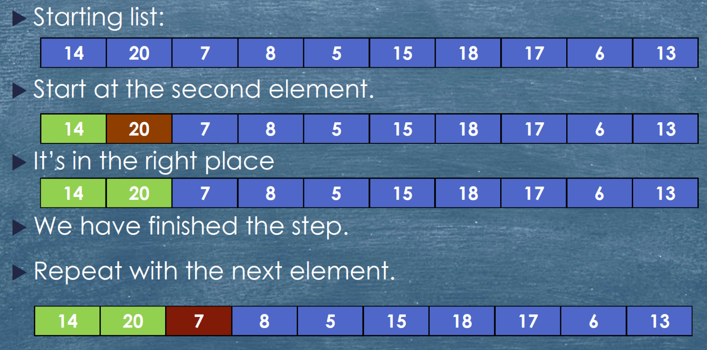

  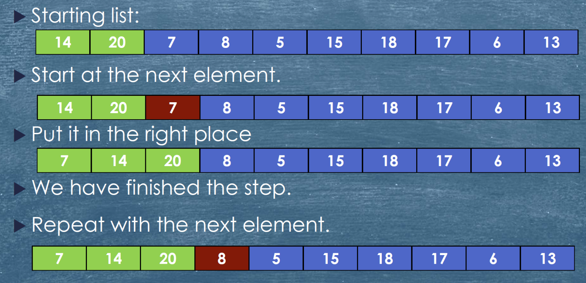

  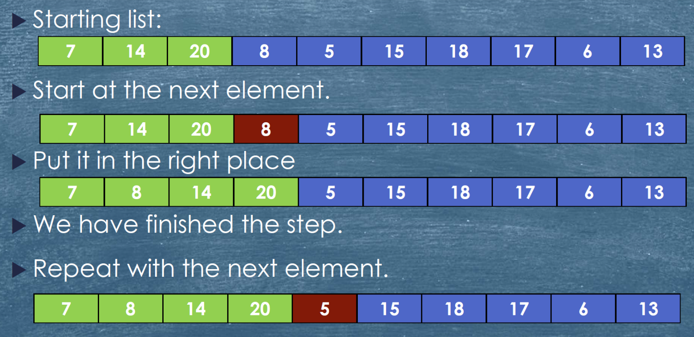

  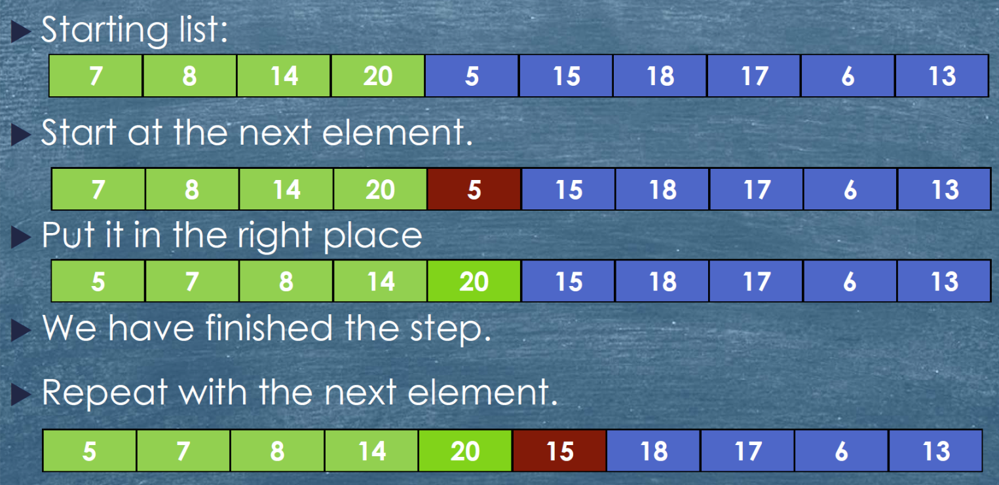

  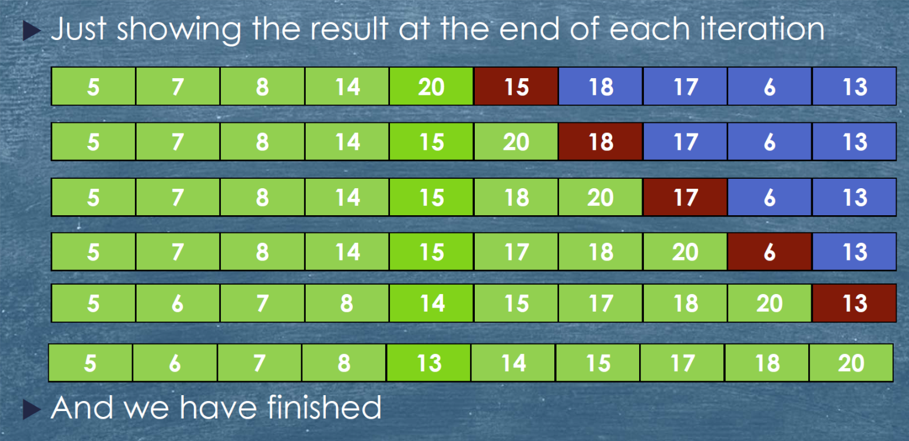

### Looking Deeper

* To sort a list of $n$ numbers requires $n-1$ iterations.
* Each iteration, however, requires that the selected entry be compared with the already sorted list until its correct location can be found.
* In the worst case this means comparing with every such element.
* So, to sort the $i^{th}$ element requires $i$ comparisons.
* Typically, the entire sort will required around $n^2/2$ comparisons.

## Mergesort

* All of the different sorting algorithms you have seen have one common feature:

  * They all sort the values *in place*, the sorted array is the same array as the unsorted one.

* Mergesort takes a different approach:

  * It uses a second array to hold the intermediate results.

* It works recursively by dividing the unsorted array into two parts and merging them in order.

* Because this procedure divides all the way down before merging back up, the final result is a sorted array. 

* The pseudocode representation of the mergesort algorithm is as follows:

  ```pseudocode
  global X[1...n]  // temporary array used in merge procedure
  
  procedure mergesort(T[left... right])
  	if left < right then
  		centre = (left + right) / 2
  		mergesort(T[left...centre])  // sort the left half
  		mergesort(T[centre + 1... right])  // sort the right half
  		// join the halves in sorted order
  		merge(T[left... centre], T[centre + 1... right], T[left... right]) 
  		
  procedure merge(A[1... a], B[1... b], C[1.. a+b])
  	apos = 1; bpos = 1; cpos = 1
  	while apos <= a and bpos <= b do
  		if A[apos] <= B[bpos] then
  			X[cpos] = A[apos]
  			apos = apos + 1
  			cpos = cpos + 1
  		else
  			X[cpos] = B[bpos]
  	while apos <= a do
  		X[cpos] = A[apos]
  		apos = apos + 1
  		cpos = cpos + 1
  	while bpos <= b do
  		X[cpos] = B[bpos]
  		bpos = bpos + 1
  		cpos = cpos + 1
  	for cpos = 1 to a + b do
  		C[cpos] = X[cpos]
  ```

  

### Mergesort Complexity Example

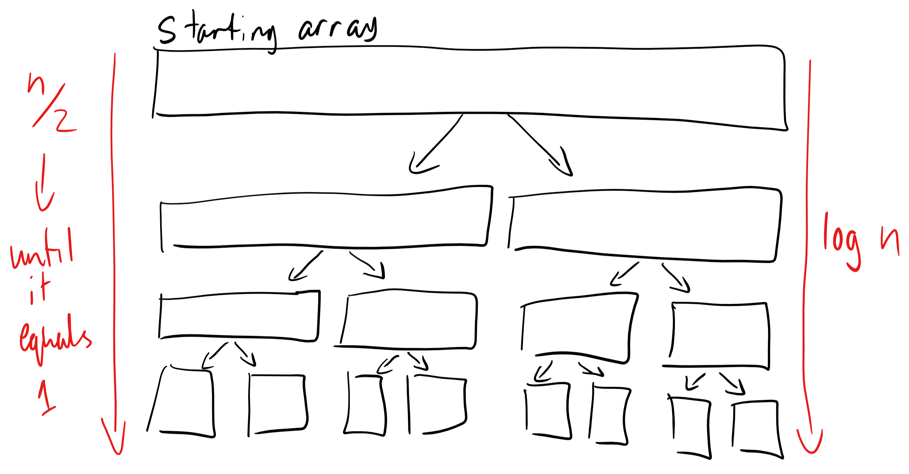

* Example

  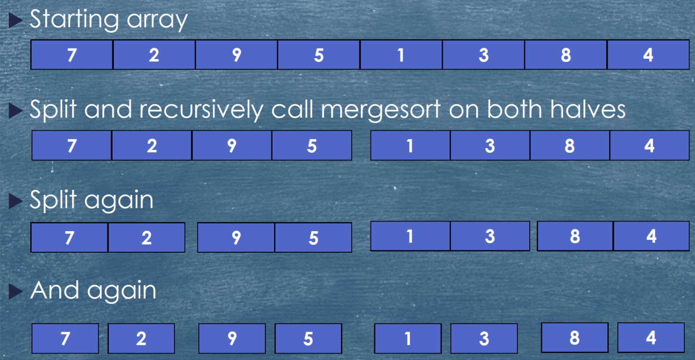

  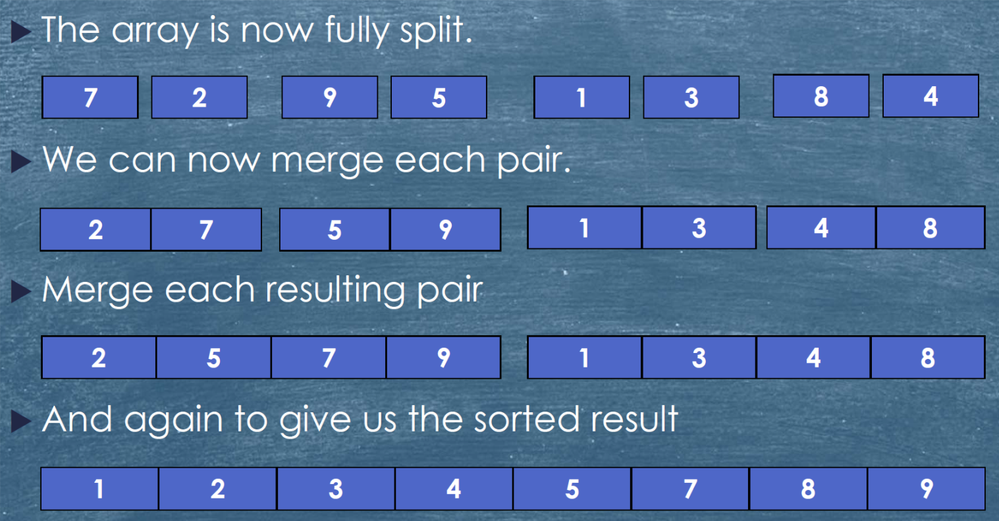

### Some Analysis

* At each level, merge operates on all $n$ items in the array.
* As each level divides the array in two, there are $log n$ levels.
* Overall, mergesort requires $n\cdot log n$ operations.
* If implementing as a recursive call, make sure implementing of auxiliary array is not memory intensive by reallocating it all the time.
  * You only need one extra copy of the the n elements at a time. 
  * Allocate it globally and reuse it all the time.

## Heaps

* The **(binary) heap** data structure is an array object that we can view as a nearly complete binary tree.

  * Each node of the tree corresponds to an element of the array.
  * The tree is completely filled on all levels except possibly the lowers, which is filled from the left up to a point.

* A heap is an essentially complete binary tree with an additional property.

* The value in any node is less than or equal to the value in its parent node (except for the root node).

* We can store a heap (or any other binary tree) in an array:

  * Heap[1] is the root of the tree.
  * Heap[2] and Heap[3] are the children of Heap[1]
  * In general, Heap[$i$] has children Heap[$2i$] and Heap[$2i + 1$]

* Example (Max Heap):

  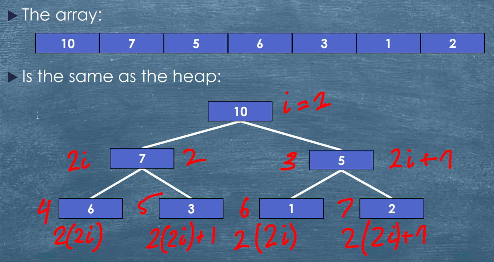

### Operations on Heaps

* If we have a non-heap how can we convert it into one?
* If we have a heap and add a new element at the next leaf how can we restore the heap property?
* If we have a heap and change the root element how can we restore the heap property?
* We need two basic functions to manage heaps:
  * **Siftup:** insert a new leaf into the correct position;
  * **Siftdown:** insert a new root element into the correct position. 
* Each compares an element of the heap with other elements, either its parent or its children. 

#### Siftup

```pseudocode
procedure siftup(Heap, i)
	// move element i up to its correct position
	if i = i return
    p = i % 2  // integer division
	if Heap[p] > Heap[i]
		return
	else
		swap(Heap[i], Heap[p])
		siftup(Heap, p)
     endif
end
```

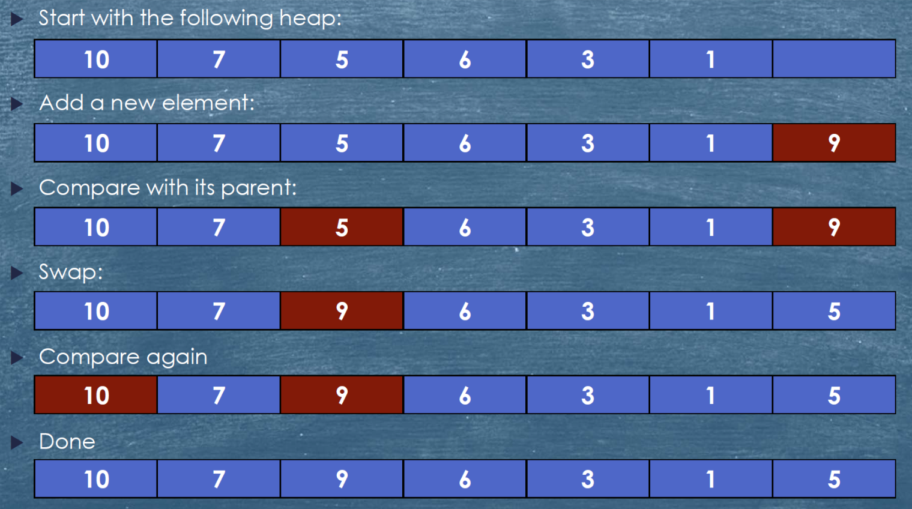

#### Siftdown

```pseudocode
procedure siftdown(Heap, i)
	// move element i down to its correct position
	c = i * 2
	if Heap[c] < Heap[c + 1] c = c + 1
	
	if Heap[i] < Heap[c]
		swap(Heap[i], Heap[c])
		siftdown(Heap, c)
	endif
end	
```

* Note: this procedure is not complete - we need to make sure we don't fall off the end of the array.

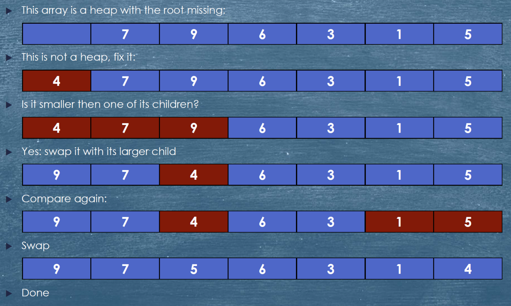

## Heapsort

* Heapsort uses the properties of a heap to sort an array.
* It proceeds as follows:
  * Convert the array into a heap.
  * Repeatedly:
    * Swap the first and last elements of the heap.
    * Reduce the size of the heap by 1.
    * Restore the heap property of the smaller heap.
  * Until the heap contains a single element.
* The array is now sorted.

### The Algorithm

* The `makeheap` procedure also uses a `siftdown`.

```pseudocode
procedure heapsort(T[1... n])
	makeheap(T)
	for i = n to 2 step -1 do
		swap T[1] and T[i]
		siftdown(T[1... i-1], 1)
```

* This uses two functions:
  * `makeheap` which converts the array into a heap.
  * `siftdown` which restores the heap property.

### Makeheap

* The `makeheap` procedure also uses `siftdown`.

  ```pseudocode
  procedure makeheap(T[1... n])
  	for i = n / 2 to 1 step -1 do
  		siftdown(T, i)
  	end for
  end
  ```

* Each element, other than the leaves, is progressively moved into the correct location.

* Example:

  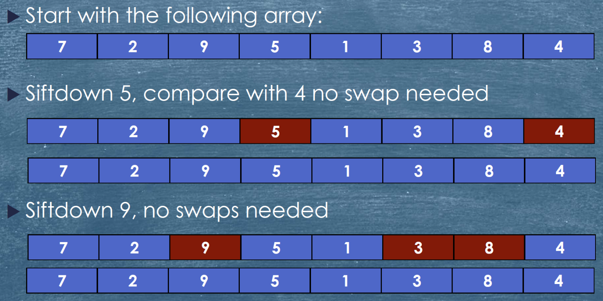

  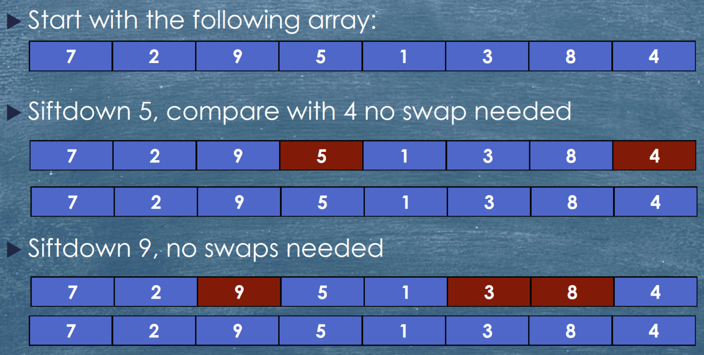

  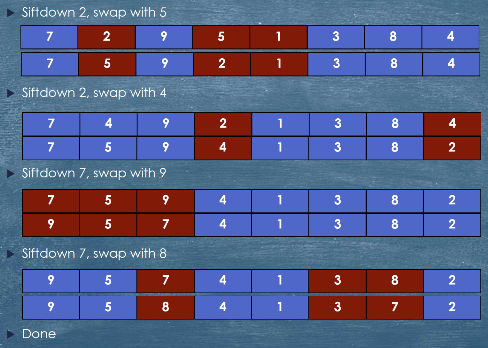

  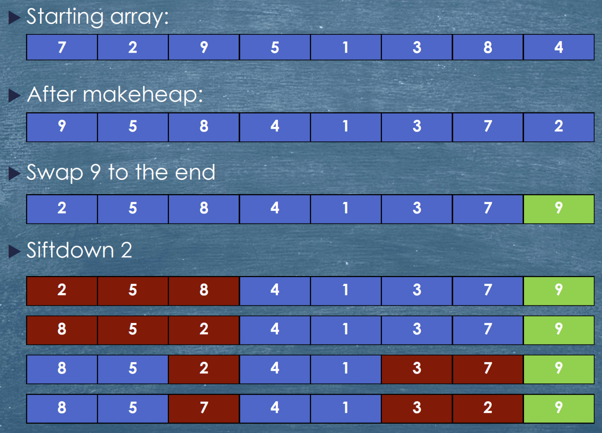

  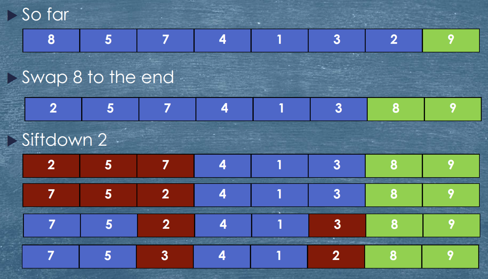

  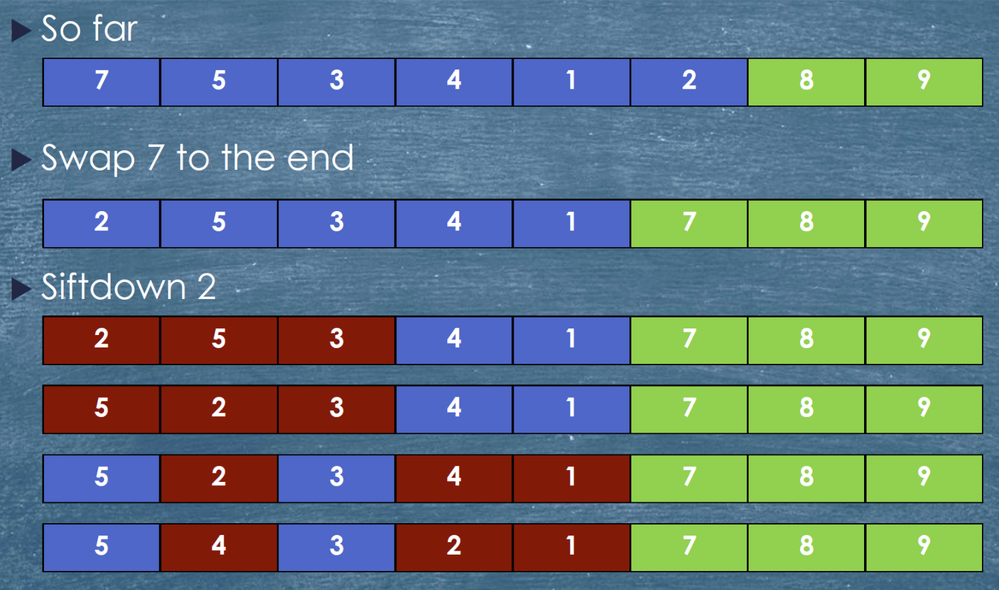

  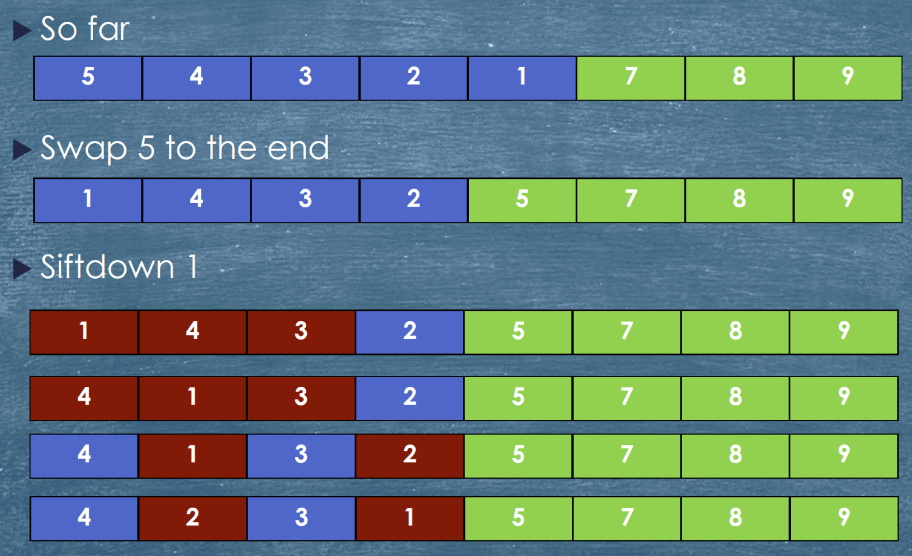

  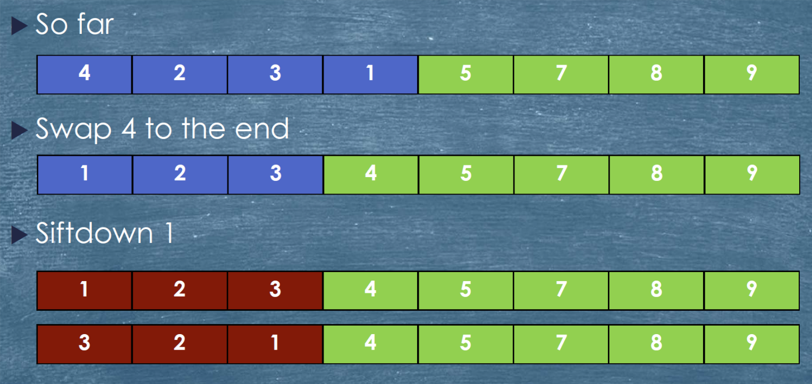

  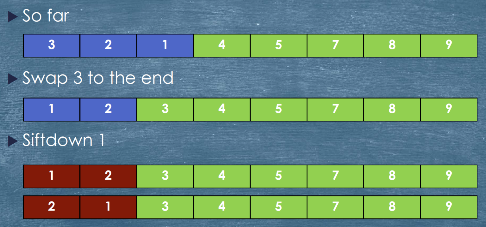

  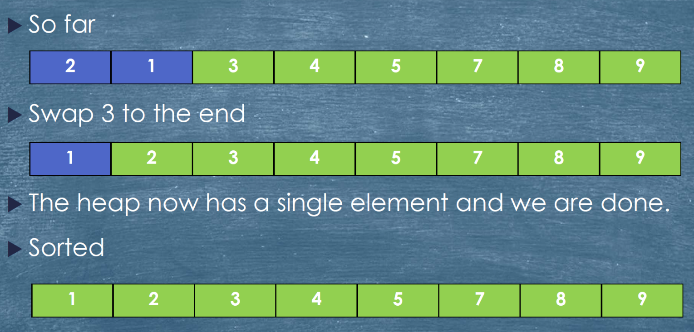

### Analysis

* `makeheap` requires roughly $n\cdot log n$ operations.
* `siftdown` requires roughly $log n$ operations.
* `siftdown` is repeated $n-1$ times
* Overall, heapsort requires roughly $2\cdot n \cdot log n$ operations

